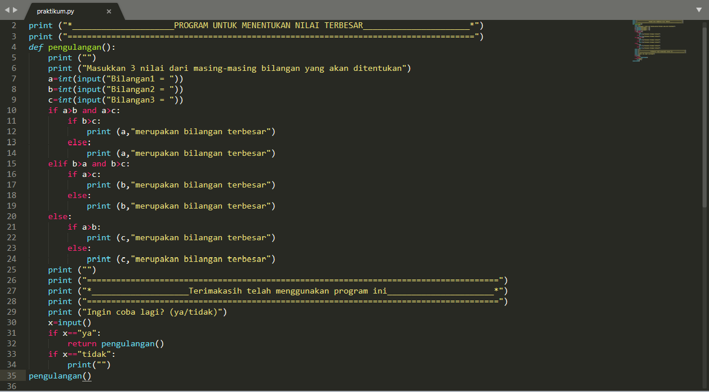
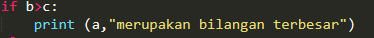
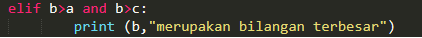
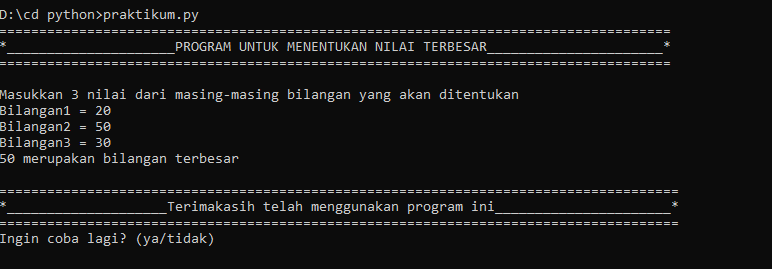

## Macam - macam kondisional python ##



- Ada tiga macam kondisional di Python, yang dapat Anda gunakan untuk membangun alur logika untuk program Anda.
Python memiliki statement _**if**_, _**if..else**_, dan _**if..elif..else**_.
Berikut ini adalah contoh penggunaan if di Python :

	

- Bila kondisi yang akan didefinisikan cukup banyak, Anda dapat menambah kondisi lain dengan menggunakan _**elif**_ di bawah statement _**if**_ dan sebelum statement _**else**_:

	
- Untuk memeriksa kondisi yang tidak memenuhi kondisi utama. 
Maka else digunakan untk menangani semua kondisi selain kondisi yang telah dituliskan. 
Berikut adalah contoh penggunaan else di dalam kondisional Python:

	

## Hasil Eksekusi ##

	