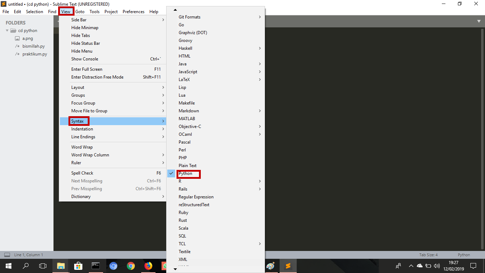
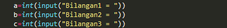
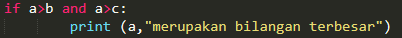
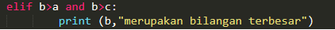
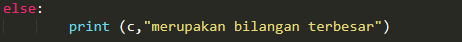
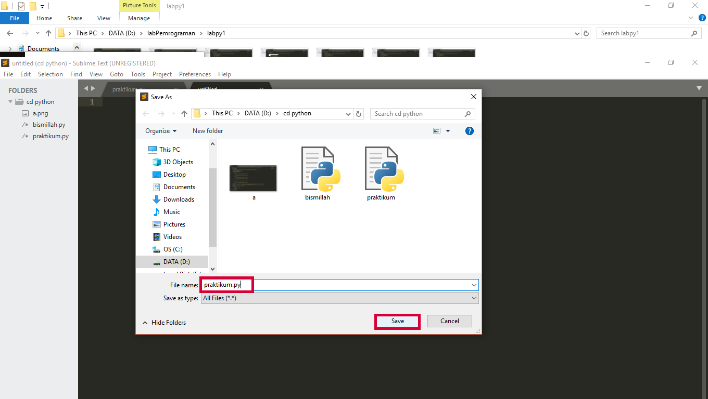
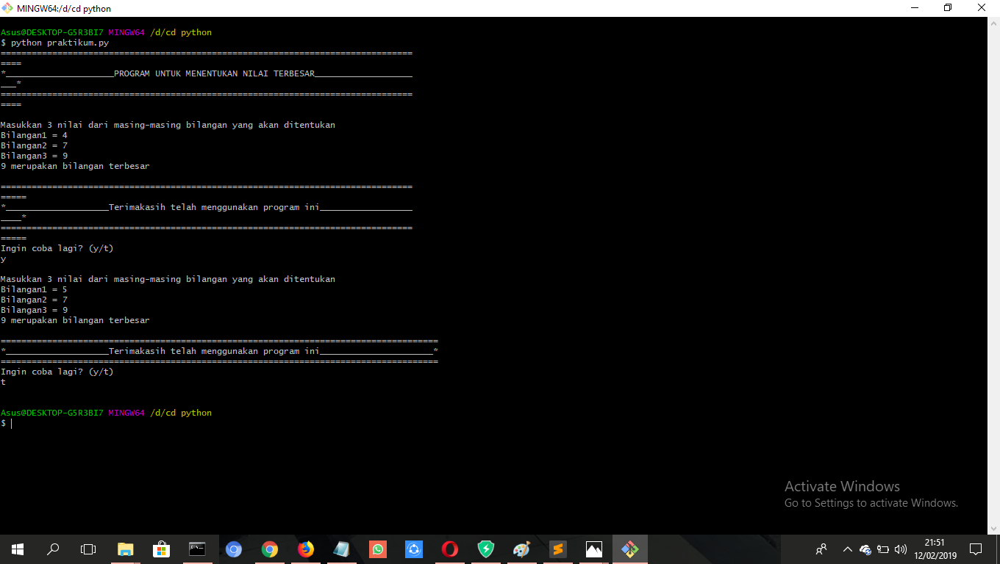

**Pertama**
Buka applikasi sublime

**Kedua**
Masuk menu view->syntax->pilih python

**Ketiga**
Jalankan perintah seperti dibawah ini

## Penjelasan program yang dibuat ##

**print** berfungsi untuk menampilkan hasil program/output.

**int(input(...))** berfungsi menampilkan program/apa yang diinputkan.

## Macam - macam kondisional python ##


- Ada tiga macam kondisional di Python, yang dapat Anda gunakan untuk membangun alur logika untuk program Anda.
Python memiliki statement _**if**_, _**if..else**_, dan _**if..elif..else**_.
Berikut adalah contoh penggunaan **if** di dalam kondisional Python:
	

- Bila kondisi yang akan didefinisikan cukup banyak, Anda dapat menambah kondisi lain dengan menggunakan _**elif**_ di bawah statement _**if**_ dan sebelum statement _**else**_.
Berikut adalah contoh penggunaan **elif** di dalam kondisional Python:

	

- Untuk memeriksa kondisi yang tidak memenuhi kondisi utama. 
Maka else digunakan untuk menangani semua kondisi selain kondisi yang telah dituliskan. 
Berikut adalah contoh penggunaan **else** di dalam kondisional Python:

	

**Keempat**
Save program (Ctrl+s), taruh penempatan file (misal di drive D:), dan beri nama.

##Hasil Eksekusi##

	